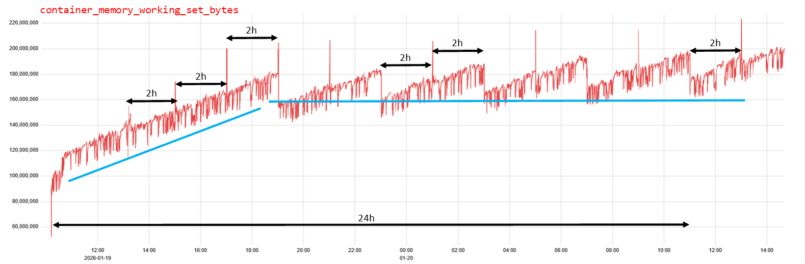
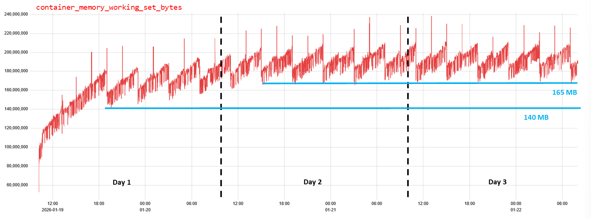

# Prometheus provisioning logbook

## Prometheus extra-cluster federation
```
containers <-- prometheus-cluster -- || --> prometheus-out --> TSDB
---------- k8s-cluster -------------    ---------- outside ---------
```

* [This Helm chart](https://github.com/prometheus-operator/kube-prometheus) deploys a `prometheus-cluster` in a given namespace of the k8s cluster to scrape the metrics exposed by [kube-state-metrics](https://github.com/kubernetes/kube-state-metrics).

* The Prometheus instance `prometheus-cluster` is federated with an extra-cluster instance `prometheus-out` managed by a monitoring-solutions provider. The former remotely write to the latter by hitting this endpoint: 
  ```bash
  <https-prometheus-out>/api/v1/write
  ```

* An OAuth2.0 authentication is performed with the Service Account credentials issued by the external provider, that are stored in:
  * `configMap` containing the `$SA_CLIENT_ID`,
  * `secret` where the secret is encoded as such `echo -n $SA_CLIENT_SECRET | base64`.

* A `networkPolicy` has to be deployed targetting `prometheus-cluster` to allow egress traffic onto port `443`:
  ```yaml
  egress:
      - to:
      ports:
          - protocol: TCP
          port: 443
  podSelector:
      matchLabels:
      app.kubernetes.io/instance: prometheus-cluster
  policyTypes:
  - Egress
  ```

* Check the outgoing traffic by opening a shell in the `prometheus-cluster` container and trying to reach the authentication endpoint thusly
  ```bash
  curl -X POST https://<auth-endpoint>/oauth2/token \
    -H "Content-Type: application/x-www-form-urlencoded" \
    -d "grant_type=client_credentials&client_id=$SA_CLIENT_ID&client_secret=$SA_CLIENT_SECRET"
  ```

* Check that there're no other hindrances in place: 
  * forbidden external connections set up by the system administration
  * invalid permissions to write to the `prometheus-out` and `TSDB` for the given service account, ...


## Prometheus OOMKilled
* Metric under scrutiny: 
```promql
container_memory_working_set_bytes
```

#### Observations 1 - 16/01/2026
* A deployment with `500Mi` of memory.
* The container is OOMKilled after nearly 3 hours of proper functioning.
* The memory utilisation as recorded by the metrics `container_memory_working_set_bytes` has a wiggling but growing trend up to figures of `140k` before crashing. These signals are processed by a pipeline made of Prometheus federation and TSDB thus adding latency.
* The subsequent restarts are suddenly killed by the startup probe receiving a `503` code.

#### Observations 2 - 19/01/2026
* A deployment with `1Gi` of memory.
* At 3 hours from deployment (**13:10Z**) a spike in memory usage is recorded over `150k` thus beyond the value previously  observed. No crash occurred. The log reads:
```
prometheus ts=2026-01-19T13:10:07.100Z caller=compact.go:519 level=info component=tsdb msg="write block" mint=1768817405883 maxt=1768824000000 ulid=01KFB60ZAJJV60AWJSXSG2MX7Q duration=682.106548ms 
prometheus ts=2026-01-19T13:10:07.290Z caller=head.go:842 level=info component=tsdb msg="Head GC completed" duration=184.826384ms
```
* A second burst of activity occurred 1h50m later (**15:01Z**). No crash occurred. The log reads:
```
prometheus ts=2026-01-19T15:00:01.723Z caller=compact.go:519 level=info component=tsdb msg="write block" mint=1768824000223 maxt=1768831200000 ulid=01KFBCA71W5A0DTMJTY066D1AB duration=1.023223747s
prometheus ts=2026-01-19T15:00:01.785Z caller=head.go:842 level=info component=tsdb msg="Head GC completed" duration=61.510404ms
```
* 1-day-long metric snapshot, with lots of burst/lows each corresponding to an activity of the kind as above reported. The temporal resolution is `10s`. The blue solid line shows the trend of two regimes, the latter less steeply but still slowly increasing.


* 3-day-long metric snapshot, with quite solid baseline established around `165MB`.


#### Context
* The message `Head GC completed` is emitted [by this function](https://github.com/prometheus/prometheus/blob/1d3d98ed16edc9a5d883bc38c47269af59d2196a/tsdb/head.go#L1423C16-L1423C48) that "runs the GC on the Prometheus' TSDB Head and truncates the ChunkDisckMapper".
* The default policy for the retention of the metrics in the Prometheus's TSDB is `24h`. This should imply that memory utilisation reaches a plateau after one day. 
* The default values for the maximum/minimum block duration are `2h`, that likely is connected to the 2h-periodicity of the bursts of memory utilisation.  

### Interpretation
* A transient burst of memory utilisation may come to pass as activity on the TSDB is performed by the container.
* The observed memory utilisation never exceeds the specified limits, though...
* This may go unnoticed if occuring on time scales smaller than those of the monitoring system set at the order of a few seconds.
